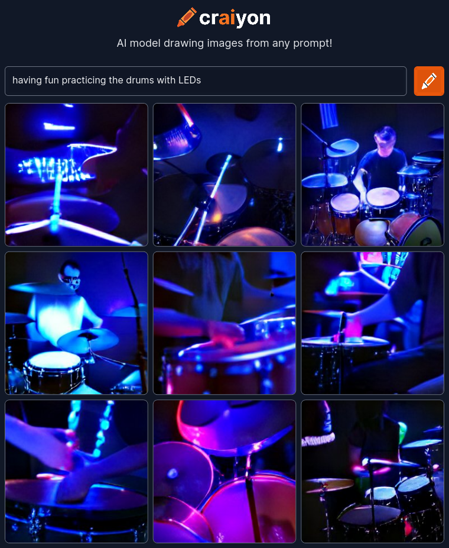
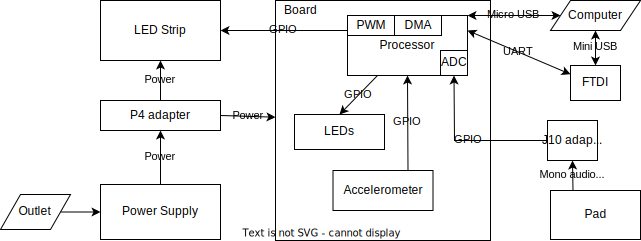
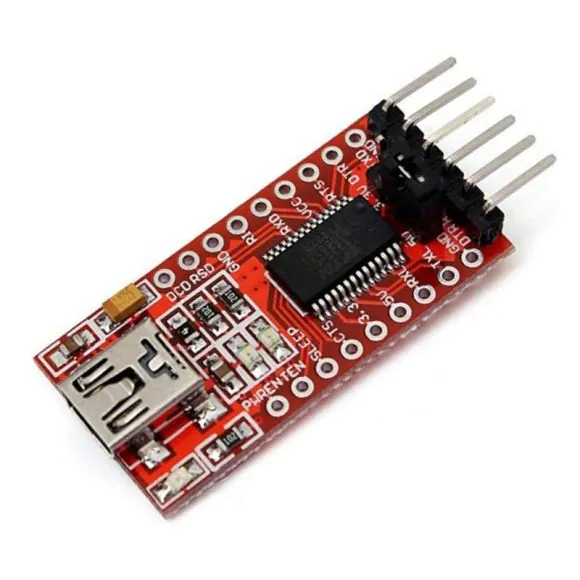
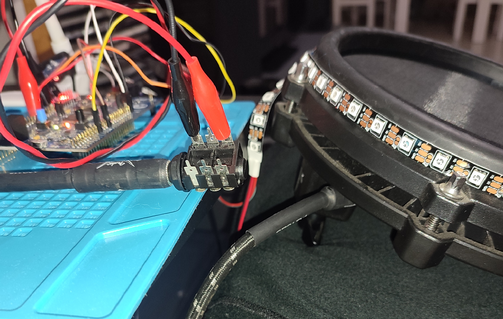
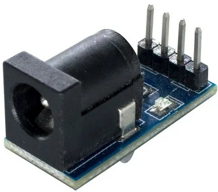
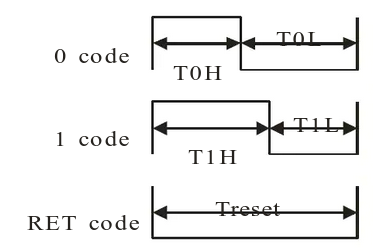
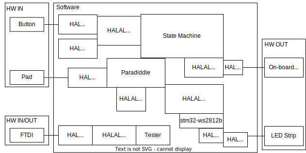

# Paradiddlepadled

A pad with LED's for practicing Paradiddles.

Final project submission for Making Embedded Systems - Yellow Seahorses  cohort by Elecia White and Classpert (https://classpert.com/classpertx/courses/making-embedded-systems/cohort)


*Figure 1 - The Paradiddlepadled*

Video demonstration: https://www.youtube.com/watch?v=h5-Xh5DLYk0

# Bill of Materials

This is the full list of materials used in this version of the system. Many of the components can be exchanged in different implementations.

* 1x STM 32F411EDISCOVERY board
* 1x Electronic drumkit pad
* 1x LED strip of around 0.75m in length
* 1x 5V 5A power supply
* 1x P4 jack adapter with VCC and GND output pins for the power supply
* 1x mono J10 jack adapter with GND and signal pins
* 1x P10-P10 mono audio cable
* 1x FT232RL mini USB <-> RS232 adapter
* 1x mini USB <-> USB A cable
* 1x micro USB <-> USB A cable
* 2x alligator cables
* 8x jumpers

# Application Description

Practicing music can be pretty boring. Could it be fun if it were pretty?

## Electronic drum kit


*Figure 2 - An electronic drum kit*

An electronic drum kit is a musical instrument that mimics the acoustic drums, consisting of several pads that the user can hit. 

These pads have piezoelectric sensors that detect the hit and send the information to a processing unit usually called the “module”.

## Paradiddles

“Paradiddles” are a common exercise for practicing playing the drums. The word  “paradiddle” is an onomatopoeia.

To do the basic paradiddle pattern, you take your drum sticks and hit one of the pads in a defined order and at a constant interval. You hit first the left stick, then the right, then left, left, right, left, right, right, and repeat. Or: L-R-L-L, R-L-R-R. It kind-of-sort-of sounds like “pa-ra-di-ddle”.

Then there are pattern variations, such as “para-paradiddle” (L-R-L-R-L-L, R-L-R-L-R-R), or “paradiddle-diddle” (L-R-L-L-R-R).

To dictate the rhythm/tempo, it is common to use a “metronome”, a device that emits a constant “beep” at a regular interval.

Doing paradiddles feels as much fun as trying to understand the previous sentences.

## The Paradiddlepadled

Let’s try to make paradiddles fun!


*Figure 3 - The joys of Computer Science in late 2022*

The Paradiddlepadled is a single electronic drum pad involved in LED's connected to a microcontroller.

The LED's around the pad glow in specific patterns depending on the current paradiddle pattern, selected tempo, and how well you are keeping the rhythm with your paradiddles. If you are doing a great job, they take a greener color. If you are doing badly, they change towards red.

There are two operation modes: "guided" and "loose". In guided mode, the LED's light up on either the left or right side at each hit. In loose mode, the LED's light up only every four hits, but all the rest is the same. The user has to keep the tempo correctly without seeing every hit indication.

The microcontroller board has controls to set the paradiddle pattern, the operation mode, and the BPM (beats per minute -- the rhythm or tempo).

# Hardware Description

## Hardware Block Diagram


*Figure 4 - Hardware Block Diagram*

## Pin connections

* P4 adapter VCC 1 - LED Strip VCC
* P4 adapter GND 1 - LED Strip GND
* P4 adapter GND 2 - Board GND
* J10 adapter GND - Board GND
* J10 adapter signal - Board PC4 (ADC1 IN)
* LED Strip signal - Board PB7 (TIM4 PWM CH2)
* FTDI GND - Board GND
* FTDI CTS - Board PD4 (USART 2 RTS)
* FTDI TX - Board PA3 (USART 2 RX)
* FTDI RX - Board PA2 (USART 2 TX)

## Microcontroller

The Paradiddlepadled runs on the STM 32F411EDISCOVERY board (https://www.st.com/en/evaluation-tools/32f411ediscovery.html), featuring an STM32F411VE MCU (Arm Cortex-M4 with FPU).

## Peripherals

### Serial Console (USART)

An FT232RL board was used to to be able to communicate with the system through a serial console. It acts as a mini USB <-> RS232 adapter. The pins RX, TX, CTS, and GND were connected to the disco board and USART2 was used in Asynchronous mode and RTS Only hardware flow control.



*Figure 5 - FTDI board*

### Electronic Drum Pad (ADC)

The pad was taken from an electronic drum kit. It consists of a round pad of rubber or other material that the user hits. Inside it there is a piezoelectric sensor that detects the force applied to the hit and outputs an analog signal to a J10 jack. A P10-P10 mono audio cable is attached to the jack and to a J10 connector for PCB's. Two of the terminals are then connected via alligator jumpers to GND and PC4 on the disco board.



*Figure 6 - Connecting the pad to the board*

The PC4 pin is set as ADC input, and the "Analog Watchdog" feature is used to trigger an interrupt when the ADC reads above a threshold. To find a good threshold, the ADC was configured to 10 bits accuracy and the board was programmed to constantly read the ADC and output to serial. With this, the "Serial Oscilloscope" application (https://github.com/xioTechnologies/Serial-Oscilloscope) was used to plot readings for different hit forces. A threshold value of 200 was selected. A debounce of 10ms was also implemented on the interrupt handler. 

Note: The ADC accuracy setting could be decreased.

### LED strip (PWM, DMA, Timer)

An individually-addressable RGB LED strip was selected for maximum flexibility. The model is WS2812B RGB (SMD 5050 RGB LED's), 60 LED/m. The area to be covered is about 0.75m, so the strip was cut at 50 LED's.

#### Powering the LED's
To power the LED's, some calculations were necessary to select an appropriate power supply. At 5V, the strip is advertised to consume a maximum of 14.4 W/m, so:

```
(14.4 W/m) / (60 LED/m) = 0.24 W/LED
0.24 W/LED * 50 LED = 12 W
12 W / 5 V = 2.4 A
```

Thus 2.4A is the maximum consumption of the strip at 5V, if all the LED's are on at maximum brightness.

To calculate the maximum possible consumption of the disco board, it was noted that it can be powered by a USB 2.0 cable. The USB 2.0 standard indicates a maximum 2.5W @ 5V = 500mA.

With that, a power supply of at least 2.9A @ 5V would be enough to power the board and the LED's at full power. In the end, a cheap- and small-enough 5V 5A wall-mount power supply was found and used for this project. This power supply has a P4 connector, so a P4 jack adapter was necessary to connect to the main board and LED strip with jumpers.



*Figure 7 - P4 adapter*

#### Controlling the LED's

The WS2812 strip communication defines a one-wire protocol that takes 3 bytes of data per LED, representing its Red, Green, and Blue values. Each bit is represented by a pulse:



*Figure 8 - WS2812 LED pulse timing diagram*

With specific timing:


*Figure 9 - WS2812 LED pulse timing table*

To achieve this control, a timer was configured with PWM to read data from DMA and generate a pulse representing each bit on a GPIO pin. Each pulse has to be 1.25µs, so the timer was configured with a 32 MHz input clock and a Counter Period value of 40:
```
32 MHz / 40 = 0.8 MHz
1 / 0.8 MHz = 1.25µs
```
The PWM Pulse value is determined by the DMA data.

References:
https://www.digikey.com.br/en/datasheets/parallaxinc/parallax-inc-28085-ws2812b-rgb-led-datasheet
https://stm32f4-discovery.net/2018/06/tutorial-control-ws2812b-leds-stm32/
https://stm32world.com/wiki/STM32_WS2812B

### Timers (PWM)

Besides the LED control described in the previous section, two more timers were used to implement the metronome pulse and the timing for each paradiddle hit.

TIM2 was configured to control the hit timing and how long the LED's will stay on. The chosen parameters are 32 MHz clock input, initial counter value 16 M, and PWM mode with a pulse value of 4 M. This means that initially hits will happen at 2 Hz (32 MHz / 16 M), and when the LED's blink to indicate a hit, they stay on for 125ms (32 MHz / 4 M).

TIM3 ended up unused, but initially it was configured to take TIM2 tick as input and tick with a counter value of 3. That is, it would tick every four hits to mark the metronome main pulse. It was used initially to light up one of the on-board LED's before the LED strip was integrated.  

### Button (GPIO)

The on-board user button generates a GPIO interrupt on each click. It recognizes the following events:
1. Single click
2. Double-click (at most 500ms between each click)
3. Hold for 1s
4. Hold for 2s

Each event will trigger actions depending on the current state (see State Machine sections). A debounce of 10ms was implemented in the interrupt handler.

### Accelerometer

As another form of event in addition to the button events, the user can double-tap anywhere on the board, which is detected by the on-board accelerometer. There must be at most 500ms between the taps, and a 10ms debounce was implemented.

A double-tap was chosen for two reasons: first, a button click is very likely to also create an accelerometer tap, so a logic was implemented to dis-consider any single taps pending when a button is pressed. Second, to reduce unintended events being triggered by touching the board in any way.

Note: this accelerometer event initially was implemented as a triple-click on the button, but the usage was annoying and the code was getting too complex.

# Software Description

The software is written in C++, taking advantaged of STM32CubeIDE facilities to configure the board (and debug), as well as the vendor's Hardware Abstraction Layer (HAL).

Note: the software could use a few rounds of refactoring. Design choices are not 100% consistent between modules (for example, some classes use static methods and some use a singleton object pattern), and organization could be improved (e.g. accelerometer logic is mixed with the button module). Since it is very hard to get to a perfect design in the realm of ideas, I usually start coding before spending too much time thinking about the code design. I let it emerge naturally as I write a few modules and get a better practical understanding of the code's needs. Then I come back and refactor some pieces. Although some refactors were done, this project has not reached the necessary level of maturity yet.

## Software Block Diagram



*Figure 10 - Software Block Diagram*

## Paradiddle
\[`Core/Src/paradiddlepadled.cc`, `Core/Src/paradiddle.cc`, \]

The C++ entry point (called from the vendor library's `main`) is at `paradiddlepadled.cc`. It initializes the accelerometer, the state machine, the serial tester, and then enters the main loop. On the main loop, it calls the tester's `read_console` function if there is console data pending, and also calls `Button::check_events` to check and process control events (button or accelerometer).

The rest of the functionality happens in global initializers and interrupt handlers around the code.

This part of the code also defines implementations to each of the State Machine action functions: `toggle_onoff`, `event_bpm_up`, `event_bpm_down`, `event_pattern_next`,  `event_pattern_previous`. This way the state machine module can focus on controlling state and not actually implementing actions on peripherals.

The `Paradiddle` class handles the ADC hit detection interrupt, as well as timer callbacks for controlling the LED's (on/off and color) and calculating hit accuracy based on timing. A hit is considered correct if it happens within ±20 ms of a timer tick. Correct hits increase the green level of the LED's, an incorrect hits increase the red levels.

## State Machine
\[`Core/Src/state_machine.cc`, `Core/Inc/state_machine.h`\]


*Figure 11 - Software State Machine table*

The state machine can be in one of 4 states. Each state represents if it is currently controlling the BPM or the pattern, and also if it is in Guided or Loose operation mode. Each state also has a combination of two on-board LED's that it lights up uniquely.

Each state respond to three action events (single and double button clicks, and button long hold), and two transition events (double board tap and button short hold).

Depending on the state, the action events will increase/decrease either the BPM or the current pattern.

## Tester
\[`Core/Src/tester.cc`, `Core/Inc/tester.h`\]

The Tester module implements a command table, each command consisting of name, description, and callback function. The module's `read_console` function reads data from the serial console and if a string matching a command name is found, the callback is called. The callbacks handle peripherals directly and are not re-used by other parts of the code, to keep the Tester module separated and possibly removable for "production" builds in the future.

The current list of implemented commands is:
```
const Tester::Test Tester::_test_table[] = {
		{"hi",   "Show greeting", Tester::greet},
		{"help", "Show this help", Tester::help},
		{"ron",  "Turn on LED indicator of Right hit", Tester::right_on},
		{"roff", "Turn off LED indicator of Right hit", Tester::right_off},
		{"lon",  "Turn on LED indicator of Left hit", Tester::left_on},
		{"loff", "Turn off LED indicator of Left hit", Tester::left_off},
		{"mon",  "Start metronome", Tester::metronome_start},
		{"moff", "Stop metronome", Tester::metronome_stop},
		{"m+",   "Increase metronome BPM by 10", Tester::metronome_up},
		{"m-",   "Decrease metronome BPM by 10", Tester::metronome_down},
		{"m+1",  "Increase metronome BPM by 1", Tester::metronome_up_one},
		{"m-1",  "Decrease metronome BPM by 1", Tester::metronome_down_one},
		{"pn",   "Go to next paradiddle pattern", Paradiddle::next_pattern},
		{"pp",   "Go to previous paradiddle pattern", Paradiddle::previous_pattern},
		{"ads",  "ADC dump start", Tester::adc_dump_start},
		//{"pws",  "Play WAV sample", Tester::play_wav_sample},
		{"mg",   "Add more green to the LEDs", Tester::more_green},
		{"mr",   "Add more red to the LEDs", Tester::more_red},
};
```

This module is very useful as a starting point for new peripherals integration, as well as debugging. It also defines a simple serial protocol such that the Paradiddlepadled can be controlled by an external controller, albeit with limited functionality currently.

## HALAL
\[`Core/Src/halal`, `Core/Inc/halal`\]

The Hardware Abstraction Layer Abstraction Layer (HALAL) contains code to handle peripherals.

### Button
\[`Core/Src/halal/button.cc`, `Core/Inc/halal/button.h`\]

This module also controls the accelerometer, as they are closely linked in functionality. Using interrupt callbacks, it handles (with debouncing) button and accelerometer clicks to distinguish between single/double clicks and short/long holds. When an event is decided, it consults the State Machine to get the current state and calls its action or transition event as appropriate.

### LED
\[`Core/Src/halal/led.cc`, `Core/Inc/halal/led.h`\]

This module defines two classes, one for controlling the on-board LED's, and another for the LED strip.

For the strip, it defines 10 accuracy levels and pre-populates all the DMA buffers containing data for each LED for each accuracy level and left or right hit. These values are pre-populated because the switching LED data is a very frequent operation that needs to be done quickly (otherwise the LED's might light up incorrectly). Thus, switching the current LED state data is just a matter of changing the buffer address to where `led_value` is pointing.

To actually drive the DMA, a third-party library stm32-ws2812b is used (described below).

## Serial Console
\[`Core/Src/halal/serial_console.cc`, `Core/Inc/halal/serial_console.h`\]

A relatively simple module that implements a C++-style stream for the UART. It defines operators for pushing `string` data, and also for reading characters until a white space. It also exposes the `has_data` function for checking if the UART has incoming data pending.

### Timer
\[`Core/Src/halal/timer.cc`, `Core/Inc/halal/timer.h`\]

Another simple module that centralizes timer parameters. It also provides the functions `bpm_up` and `bpm_down` which convert between beats per minute and the paradiddle timer period.

## Third-party

### STM32 HAL

Standard HAL given by the STM32CubeIDE, used for control of various peripherals.

### Meta
\[`Core/Inc/meta.h`\]
License: GPL 2.0

Template metaprogramming helper functions taken from the EPOS project (https://gitlab.lisha.ufsc.br/epos/epos/-/blob/develop/include/system/meta.h). 

### BSP
\[`Drivers/BSP`\]
License: BSD-3-Clause

Extra HAL functions specific to the 32F411EDISCOVERY board. Taken from the "Audio_playback_and_record" example download directly in the STM32CubeIDE.

This contains functions to control the accelerometer, as well as the DAC/audio output capabilities which are not used in the current version.

### stm32-ws2812b
\[`stm32-ws2812b`\]
License: MIT

Library to control the WS2812B LED strip with DMA on an STM32 board (https://github.com/lbthomsen/stm32-ws2812b).

# Build Instructions

Simply import the code into STM32CubeIDE as an existing project and click "Project -> Build Project". It can be loaded into an STM 32F411EDISCOVERY connected via USB running the default bootloader. It will also provide GDB capabilities from the IDE (breakpoints, etc).

The project was initially developed using the toolchain "GNU Tools for STM32 (10.3-2021.10)" on an x86_64 Arch Linux host (kernel 6.0.6-arch1-1).

For hardware build instructions, refer back to "Bill of Materials" and "Hardware Description" sections.

As discussed earlier, the system is powered by a 5V 5A wall-mount power supply, although it requires less than 3A. If the system can be made more portable, it would be beneficial to try to run on batteries, especially considering that only at most half the LED's will stay on at a given time, and that the full brightness of each LED is _really_ bright (that is, the power budget could potentially be much lower than 3A).

## Debugging

As discussed in previous sections, some tools that have helped debugging the system are:
* Starting a new peripheral by writing a simple command on the serial tester,
* Debug mode with breakpoints and memory analysis, especially to understand interrupt flows,
* Serial Oscilloscope for bring-up and fine-tune of ADC.

# Future

Some directions for future improvements include:
* Improve the hit analysis algorithm,
* Implement logging of practice time with accuracy progression,
* Reduce the form-factor with a custom PCB, such that the system is more portable. Consider powering with batteries,
* Implement audio output for metronome pulses and hits,
* Implement MIDI output,
* Expand the serial protocol, or perhaps implementing another communication path for an external system to control the Paradiddlepadled,
* Expand the project to include LED's in all the pads of an electronic drum kit, such that it could play back whole songs or sections for the user to follow, learn, and practice. This could include a "performance mode" so that the LED's light up according to the user's hits,
* Study the involved delays to ensure the LED's are lighting up at correct and regular intervals,
* Study differences in user accuracy when using the LED output vs. the audio metronome output.
